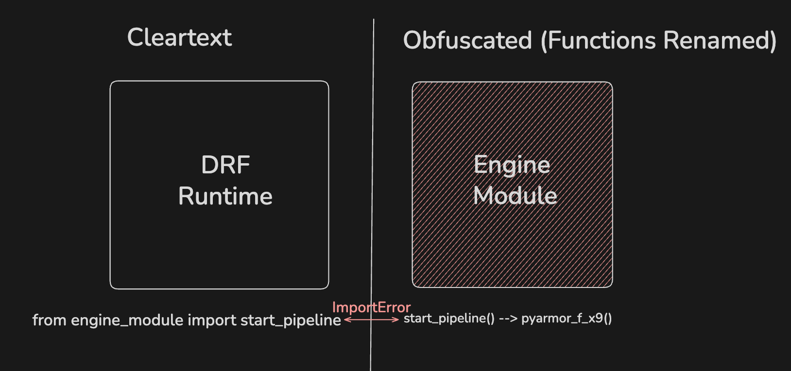

# Journal Entry: January 26, 2026

**Project ID:** f59a6424-be1f-49c7-82df-01efe73099e8  
**Series:** 001  
**TAGS:** #pyarmor, #django #architecture, #obfuscation #security, #reverse_engineering_security, #software_licensing

### Description:

> This project was to research and implement a way to obfuscate certain modules of the application which contains intellectual property. This was necessasry due to the application code being directly deployed unto the client's machine.  

## Context

The application runs **Django ASGI using Uvicorn**. We have a engine directory/module that is imported in Django Views to orchestrate and execute business logic which needed to be protected/obfuscated.   
I took over the task from my manager who was working already working on it midway (he had to drop the task for other priorities). He had caught me up on using a previous version of pyarmor `(v7.7)` which worked, however, the newer version `(v9.2)` did not work because he was using **RFT** mode (Rename Function/Type).  

## Obfuscation Research and Challenges

### Obfuscation, Pyarmor, and RFT

**PyArmor** is a CLI tool that locks down Python scripts so people can't steal or reverse-engineer the code IP . Under the hood, it encrypts the Python bytecode and wraps it in a runtime guard. The code only gets decrypted in memory _right_ when the code is executed via the runtime guard.

For this project, I looked at two main ways to run it:

1.  **Standard Mode (`pyarmor gen`)**: This is the "vanilla" option. It encrypts the code (the bytecode instructions) but keeps the skeleton intact—meaning function names, class names, and variables stay the same.
2.  **RFT Mode (`--enable-rft`)**: Before compiling, RFT rewrites the source code and changes readable names (like `check_password`) into randomized strings (like `f_x1`). RFT essentially changes the **semantics** of the code, so that even when the bytecode is decrypted, the semantic meaning is lost.

**The Risk of Standard Mode:**
The issue with just running standard `pyarmor gen` is that it relies almost entirely on the encryption. An advanced hacker can dump the memory while the app is running, which stores the python bytecode , and can use tools such as `uncompyle6` or `pycdc` to decompile it (assuming they can also decrypt it).

| Feature       | Standard Obfuscation (`pyarmor gen`)                                                | RFT (`pyarmor gen --enable-rft`)                                        |
| :------------ | :---------------------------------------------------------------------------------- | :---------------------------------------------------------------------- |
| **Mechanism** | Encrypts Python bytecode. Preserves symbol names.                                   | Rewrites source code to rename symbols (e.g., `get_user` $\to$ `f_x9`). |
| **Use Case**  | Framework-heavy apps (Django/FastAPI) or large codebases.                           | Algorithmic IP where logic must be hidden.                              |
| **Weakness**  | "Security by Obscurity." Vulnerable to memory dumping & decompilers (`uncompyle6`). | Breaks "Duck Typing" & external imports if not configured correctly.    |

### Challenges

#### Runtime Problem

Because RFT renames functions, it is extremely difficult to obfuscate standard DRF capabilities like views, routing, models, ...etc., without the application breaking. This is because DRF expects these function names to be standard in the application. For example, `path('user/<id>/', views.get_user)` fails because RFT compiles the code from `def get_user(id):` into `def py_fn_1(py_arg_1):`, causing Django to first fail finding `views.get_user (AttributeError)`, and if fixed, fail passing the parameter `id=5 (TypeError)`.

#### Module Boundary Problem

The solution to the above is to leave the DRF runtime unobfuscated since it contains no significant IP that needs to be protected. However, the same import depedency problem appears again due to the fact that you now have a boundary of unobfuscated (not renamed) and obfuscated (renamed) code -- causing **import dependency hell**.

### Key Takeaway

> RFT provides excellent protection against reverse engineering, but it is rarely a 'drop-in' solution for dynamic applications. Ideally, an application should be designed with RFT constraints in mind from the start. However, because the application was built to prioritize feature iteration over security architecture, integrating RFT at this stage would require extensive refactoring.
