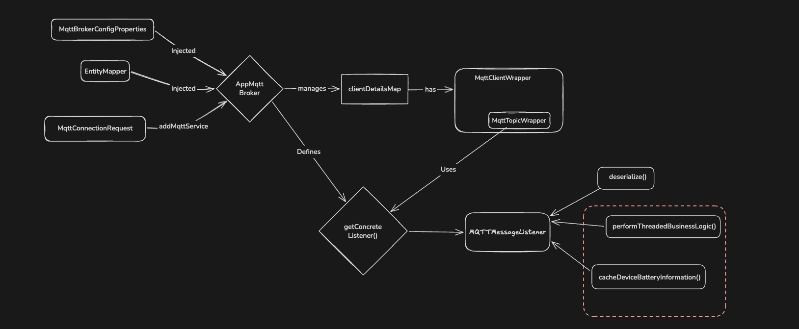

# Journal Entry: February 24, 2026

**Project ID:** ff670cde-51de-4c06-adc2-7c7b5440b9c1 <br>
**Series:** 002 <br>
**TAGS:** #spring_boot, #event_driven, #async, #jackson, #profiling <br>

> **TLDR:** Was tasked with a caching requirement that was going to make the MQTT Listener into a coupled "God Class". Decoupled it using Spring Events, but stumbled down a rabbit hole discovering our "async" events were actually synchronous. Fixed the thread pooling, then profiled our Jackson deserialization—optimizing it from **497ms** down to **361ms** by swapping `readTree()` + `convertValue()` for `treeToValue()`.

## Task & Execution: The "God" Listener Problem

After the discussion with my manager, I received an extra requirement: cache the device battery information (derived from the MQTT broker via the MQTT messages from the IOT devices) into Redis.



The problem? Our MQTT Feature (Service) was already complicated. We had dynamic configuration, polymorphism, and an `MQTMessageListener` performing heavy business-specific logic on top of standard message deserialization and filtering. Adding Redis caching directly into this flow would create a tightly coupled "God" Listener.

I pushed to leverage Spring Events. The idea was simple: let the MQTT infra solely handle client management, subscription, and deserialization. Once parsed, it publishes an event. The caching and SOS management logic act as decoupled observers sitting cleanly in the business domain.

## The Spring `@Async` Surprise Check

Knowing our new expected throughput, I wanted to assign a dedicated thread pool to the event listeners coming from the `MQTTMessageListener` so we wouldn't exhaust the default pool. I added a configuration class, but the application flat-out failed to compile.

I initially thought our application was already processing events asynchronously because we had listeners annotated with `@Async` from a previous feature. I assumed they were working perfectly.

> That forced me to look under the hood. I realized something odd: without explicitly adding the `@EnableAsync` annotation to a configuration class, Spring silently ignores the `@Async` annotations on your methods. Our application had been processing all those "asynchronous" events _synchronously_ on the exact same thread where they were published.

### Deep Dive: Spring Proxies and Thread Hand-offs

Finding out `@EnableAsync` was missing led me down a massive rabbit hole: _How does Spring actually execute asynchronous code?_ Because the application container runs on a main thread, a function can't just magically decide to run on a different thread by itself. It needs a manager to intercept the call and handle the thread hand-off. When you enable the async engine, Spring achieves this by creating a **Proxy Class** for any bean containing an `@Async` annotation.

Spring proxies operate in two primary ways:

1. **JDK Proxies (The Default):** This applies to any class implementing an interface. The interface methods define exactly what can be proxied.
2. **CGLIB Proxies:** If there is no interface, Spring generates a subclass of your annotated class at runtime.

**The Danger of CGLIB:** While CGLIB is convenient, subclassing means that any dependencies injected into the constructor are effectively instantiated _twice_ (once for the actual bean, once for the proxy). If you have complex dependencies—like a database repository expecting a single, stateful connection—this double-instantiation can cause silent, disastrous bugs.

Because of this, I explicitly designed our decoupled listeners to use interfaces so we could rely safely on JDK proxies for the thread hand-off.

## Double Checking and Working Backwards

As I was writing the new caching logic—specifically the requirement to only update Redis if the cache had expired—I started wondering about performance. The cost of rejecting messages was minimal (just a simple boolean condition check).

But that got me thinking: what about the performance cost of the Spring Event Bus itself? Could it handle our expected **4000 msg/sec** throughput? Research indicated the Spring Bus was lightweight enough.

So I went _even further_ down the rabbit hole: Could our _deserialization code_ handle that throughput to actually feed the bus in the first place? I knew we were using Jackson JSON Node Parsing, which is inherently expensive because it builds a hashmap-like tree. I used IntelliJ profiler to find out.

The result was grim: **497ms** execution time for 400 msgs/s.

My mind had initially been set entirely on readability and maintainability over performance. Because I had implemented the POJOs to be polymorphic, I was using `readTree()` to build a full DOM tree of the message. This makes memory usage huge because primitive fields are wrapped in `JsonNodes` and objects in `LinkedHashMaps`. Then, I was liberally using `convertValue()` to map it to the correct concrete class.

My CPU cost per message was effectively: `Cost(readTree()) + Cost(2*convertValue()) + Cost(N*convertValue())`.

### The Refactor: `treeToValue()`

To optimize this, I had to clean up the unnecessary `convertValue()` calls. I couldn't entirely map everything manually without defeating the purpose of using Jackson for readability, but I could be smarter about it.

I opted to manually extract the common header fields (`tm`, `gw`, `seq`) directly from the parsed node. Then, for the inner `adv` array, instead of using `convertValue()`, I switched to `treeToValue()`, which is a much more optimized approach for Node-to-POJO conversions.

```java
// EFFICIENT: Manually pull headers to avoid full object mapping overhead
String tm = rootNode.path("tm").asText();
String gw = rootNode.path("gw").asText();
Long seq = rootNode.path("seq").asLong();

// EFFICIENT: Using treeToValue for the specific inner payloads instead of convertValue
if (MQTTConstant.PAYLOAD_A_TYPE.equals(type)) {
    payloadListA.add(objectMapper.treeToValue(node, PayloadA.class));
}
```

## Summary / Key Takeaway

By cleaning up unnecessary DOM-to-Object conversions and utilizing `treeToValue()`, execution time dropped significantly to **361ms** for 400 msg/s. It was an awesome feeling to optimize for good code -- decoupling the architecture via Spring Events. It is an even better one to learn about the inner workings of Springs like Spring proxies and thread hand-offs.
