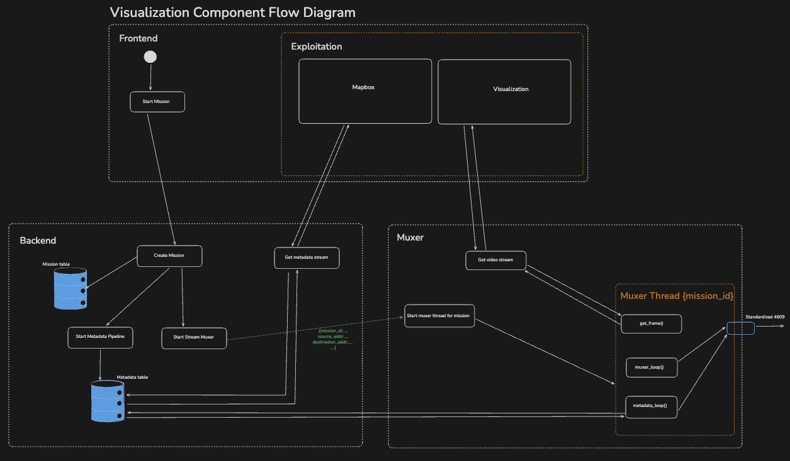
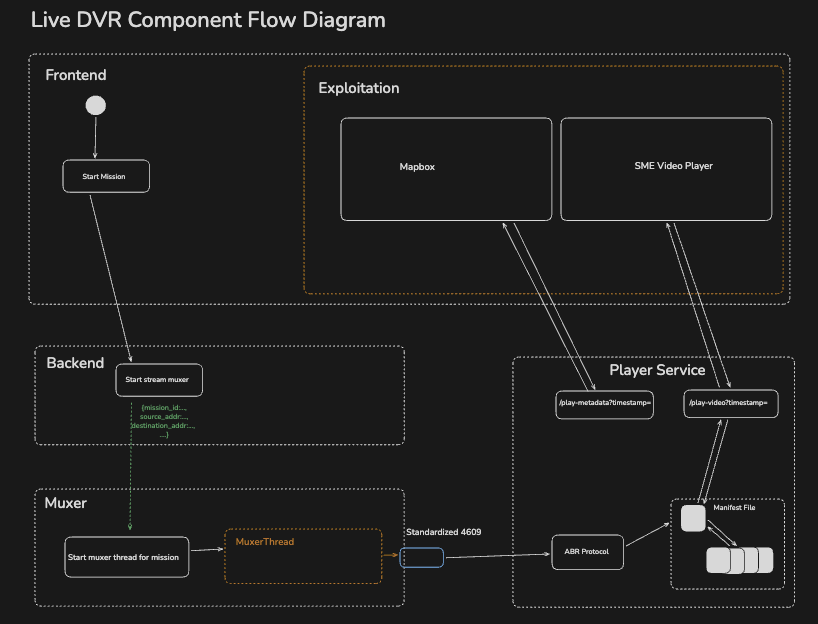

# 001

- so for context, this project is a step in the evolution of our product offerings. Our main exploitation/visualization capabilities has always been a real time stream where we process both the video feed and method and mux it together. Now we want to introduce a DVR like capabilities, such as playing, pausing, jump to live and time seeking capabilities to this live stream.

## Introduction

The current system standardizes a live drone feed into STANAG 4609 by running two main backend modules:

Metadata module: sniffs raw metadata packets from the NIC, standardizes them, and persists them to the DB.
Muxer module: a separate GStreamer (PyGObject) pipeline ingests live video (UDP/RTSP), prepares an MPEG-TS output, and injects metadata asynchronously from the DB into the outgoing stream.

The system is able to visualize the stream by utilizing two server-sent events (SSE):

1. Metadata SSE: Pulls standardized metadata from the DB and drives the MapboxGL overlay in the frontend.
2. Video SSE: Pulls frames from the GStreamer pipeline, base64 encodes them, and renders in the frontend via an  html element.

Below, is a high-level component flow diagram of the current stream visualization of the application.

## Feature Summary

Goal: Add a Digital Video Recorder (DVR)-like playback experience for operators:

- Live playback with “good enough” latency: ~2–3 seconds
- Pause / Rewind / Seek within a configurable rolling window
- Jump-to-live instantly
- Synchronized metadata overlay on MapboxGL matching the playback timestamp
  > Key decision: Implement as a new backend microservice, **playback_service**, which ingests an MPEG-TS stream, creates a rolling window of segments and manifests, and exposes APIs for both the video player and metadata sync.

## Key Assumptions

1. No changes to existing processes
   - Metadata module and muxer module continue unchanged.
   - The new capability is delivered via a separate microservice and a separate frontend page.

2. Rolling DVR window
   - Storage for rewind is capped by hardware.
   - Window size is configurable via environment variables (e.g., PLAYER_DVR_WINDOW_SEC), implemented as a rolling playlist/buffer.
   - Trailing edge, edge case

3. Deployment environment
   - Primarily LAN / closed network.
   - Runs in Docker on Windows and Linux hosts.
   - Run on Arm64 and Amd64 architecture

4. Expected live latency
   - Some latency is acceptable when “near-live”.
   - Playback must remain smooth and reliable.

5. Frontend playback technologies
   - Frontend will use Media Source Extension (MSE)-compatible technologies to allow for live and playback streaming.

Key considerations

1. Compute cost (ABR ladder is the big lever)
   - Three renditions (420p, 720p, 1080p) usually implies transcoding, which can dominate CPU/GPU.
   - After discussion with team, we are going with a straight-through encoding (i.e. no ladder) to reduce cost.

2. Keyframe cadence affects seek smoothness
   - Key frame interval has to be at least 1–2s to ensure smooth time-seeking.

3. Metadata synchronization
   - Since synchronization is needed on the basis of asynchronous streaming/muxing, there is a potential for affecting the backend and muxer module

### High-level architecture (Design decisions proposed):

1. Muxer module outputs a live MPEG-TS stream (as of today).
2. `player_service` ingests that MPEG-TS stream and processes the stream to enable playback and streaming.
3. Angular Player Page
   - Uses MSE-compatible technologies to leverage live stream and playback
4. MapboxGL overlay
   - Driven by metadata events aligned to the player’s video clock.
   - Uses a metadata sync channel (likely WebSocket or time-indexed HTTP) to fetch/push metadata matching the current playback time.

