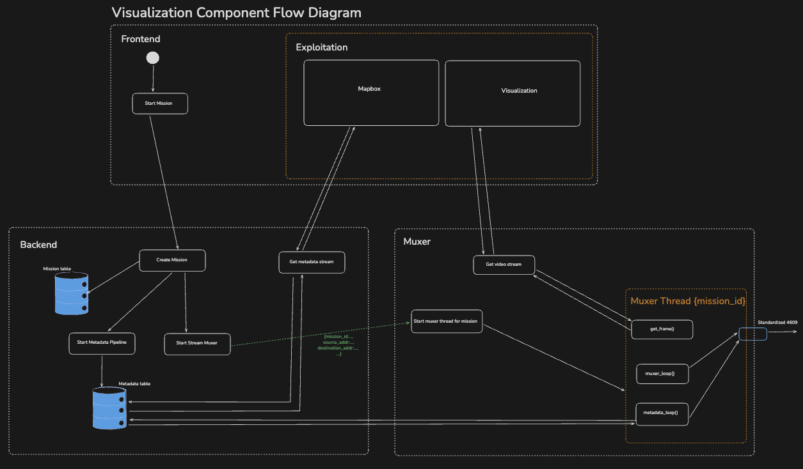
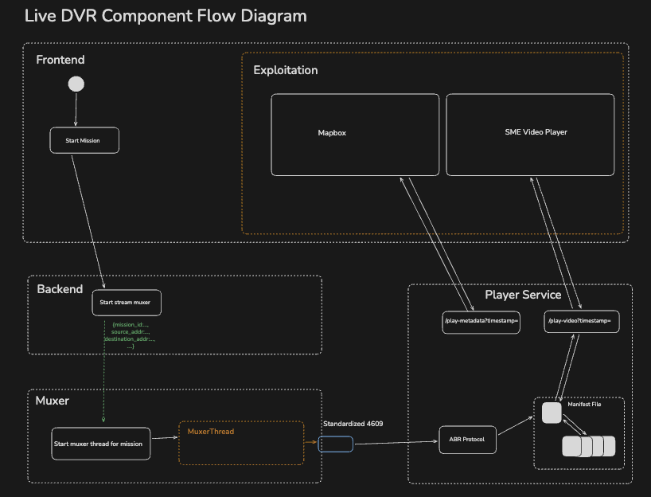

# 001

- so for context, this project is a step in the evolution of our product offerings. Our main exploitation/visualization capabilities has always been a real time stream where we process both the video feed and method and mux it together. Now we want to introduce a DVR like capabilities, such as playing, pausing, jump to live and time seeking capabilities to this live stream.

## Introduction

The current system standardizes a live drone feed into STANAG 4609 by running two main backend modules:

Metadata module: sniffs raw metadata packets from the NIC, standardizes them, and persists them to the DB.
Muxer module: a separate GStreamer (PyGObject) pipeline ingests live video (UDP/RTSP), prepares an MPEG-TS output, and injects metadata asynchronously from the DB into the outgoing stream.

The system is able to visualize the stream by utilizing two server-sent events (SSE):

1. Metadata SSE: Pulls standardized metadata from the DB and drives the MapboxGL overlay in the frontend.
2. Video SSE: Pulls frames from the GStreamer pipeline, base64 encodes them, and renders in the frontend via an  html element.

Below, is a high-level component flow diagram of the current stream visualization of the application.

## Feature Summary

Goal: Add a Digital Video Recorder (DVR)-like playback experience for operators:

- Live playback with “good enough” latency: ~2–3 seconds
- Pause / Rewind / Seek within a configurable rolling window
- Jump-to-live instantly
- Synchronized metadata overlay on MapboxGL matching the playback timestamp
  > Key decision: Implement as a new backend microservice, **playback_service**, which ingests an MPEG-TS stream, creates a rolling window of segments and manifests, and exposes APIs for both the video player and metadata sync.

## Key Assumptions

1. No changes to existing processes
   - Metadata module and muxer module continue unchanged.
   - The new capability is delivered via a separate microservice and a separate frontend page.

2. Rolling DVR window
   - Storage for rewind is capped by hardware.
   - Window size is configurable via environment variables (e.g., PLAYER_DVR_WINDOW_SEC), implemented as a rolling playlist/buffer.
   - Trailing edge, edge case

3. Deployment environment
   - Primarily LAN / closed network.
   - Runs in Docker on Windows and Linux hosts.
   - Run on Arm64 and Amd64 architecture

4. Expected live latency
   - Some latency is acceptable when “near-live”.
   - Playback must remain smooth and reliable.

5. Frontend playback technologies
   - Frontend will use Media Source Extension (MSE)-compatible technologies to allow for live and playback streaming.

Key considerations

1. Compute cost (ABR ladder is the big lever)
   - Three renditions (420p, 720p, 1080p) usually implies transcoding, which can dominate CPU/GPU.
   - After discussion with team, we are going with a straight-through encoding (i.e. no ladder) to reduce cost.

2. Keyframe cadence affects seek smoothness
   - Key frame interval has to be at least 1–2s to ensure smooth time-seeking.

3. Metadata synchronization
   - Since synchronization is needed on the basis of asynchronous streaming/muxing, there is a potential for affecting the backend and muxer module

### High-level architecture (Design decisions proposed):

1. Muxer module outputs a live MPEG-TS stream (as of today).
2. `player_service` ingests that MPEG-TS stream and processes the stream to enable playback and streaming.
3. Angular Player Page
   - Uses MSE-compatible technologies to leverage live stream and playback
4. MapboxGL overlay
   - Driven by metadata events aligned to the player’s video clock.
   - Uses a metadata sync channel (likely WebSocket or time-indexed HTTP) to fetch/push metadata matching the current playback time.

## 002

The initial plan and architecture design were based on my own research, but before diving into implementation, I took the initiative to reach out to a senior engineer who has deep domain expertise in MISB standards and MPEG-TS streaming. This feature is an open-ended and complex challenge with little to no resources or guidance available online, particularly regarding the metadata synchronization problem. While implementing DVR features for video alone is relatively straightforward, the real challenge is synchronizing the metadata with a specific video frame or point in time.

During our discussion, he showed me the work he’s been doing on playing MPEG-TS streams directly in the browser. He demonstrated a WebAssembly (Wasm) library he developed that allows for the demuxing of MPEG-TS in the browser. I was curious and amazed because I didn't realize such technology existed for the web. We talked about how WebAssembly works—essentially as an extension of web browsers that allows for running isolated, high-performance code. You write the code in a language like C or C++, compile it into WebAssembly machine language, and then the browser's JS engine can execute it via the WebAssembly API. It’s a very cool concept; since the technology is relatively new and not yet fully mature, it’s fun to explore the boundaries of what’s possible.

The limitation with using his WebAssembly library in our case was that it currently only works with MPEG-TS files uploaded directly into the browser. While the demuxing and decoding of the KLV was functional, it wasn't enough to cover the full DVR functionality and scope we need. I proposed a way to leverage HLS, since it already segments the stream into MPEG-TS files. If we could segment the stream with the KLV metadata attached, we could read those segments from an ABR-compatible client like Shaka Player and use his WebAssembly decoder to extract the metadata section from the incoming segments.

He then advised me to look into the MISB ST 1910 standard, which defines the encoding of KLV metadata in an ABR protocol, specifically using the Common Media Application Format (CMAF). I had done some brief research on CMAF before but dismissed it as out of scope, thinking we didn't need the versatility of a protocol that supports both HLS and MPEG-DASH simultaneously. However, he explained that CMAF has a property called `emsg` boxes designed specifically for carrying KLV metadata. Thanks to this discussion, I finally have a clear direction on how to tackle the metadata synchronization problem.

# 003
